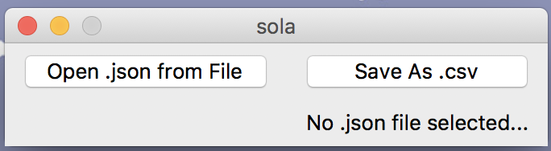

# sola

sola is a simple JSON to CSV program for Otogi written in Python. 
<br/>It grabs daemon data from the input JSON file and writes it to a nicely formatted CSV file (with a header!) for easier data manipulation.

There are two ways to run sola. sola.py runs on the command line while sola_v2.py is a GUI application (and much cleaner than sola.py).

## Getting Started

You will need:
* [Python 3.6+](https://www.python.org/downloads/) 
* [sola.py](sola.py) or [sola_v2.py](sola_v2.py)
* Otogi JSON file (or use echo.json in example folder)

## Running sola: using sola.py

Move sola.py and the JSON file into the **same directory**. This could be your Desktop or any other easily accessible location. **The output CSV file will be in the same directory as sola.py and the JSON file.**

The following example is in Terminal (macOS).
Run sola.py: 
```
$ python3 sola.py
```

When sola asks for any file name, enter it **without the extension**. 
<br/>For example, if the JSON file name is *filename.json*, enter it as *filename*:

```
Enter json file name: filename
```

Example run where the JSON file name is *echo.json* and the file name I want to write to is *daemon-info.csv*:

```
$ python3 sola.py
Enter json file name: echo
Enter file name to write daemon information to: daemon-info
sola has finished writing to 'daemon-info.csv'
```

## Running sola: using sola_v2.py

The following example is in Terminal (macOS).
Run sola_v2.py and the GUI application will display: 
```
$ python3 sola_v2.py
```

